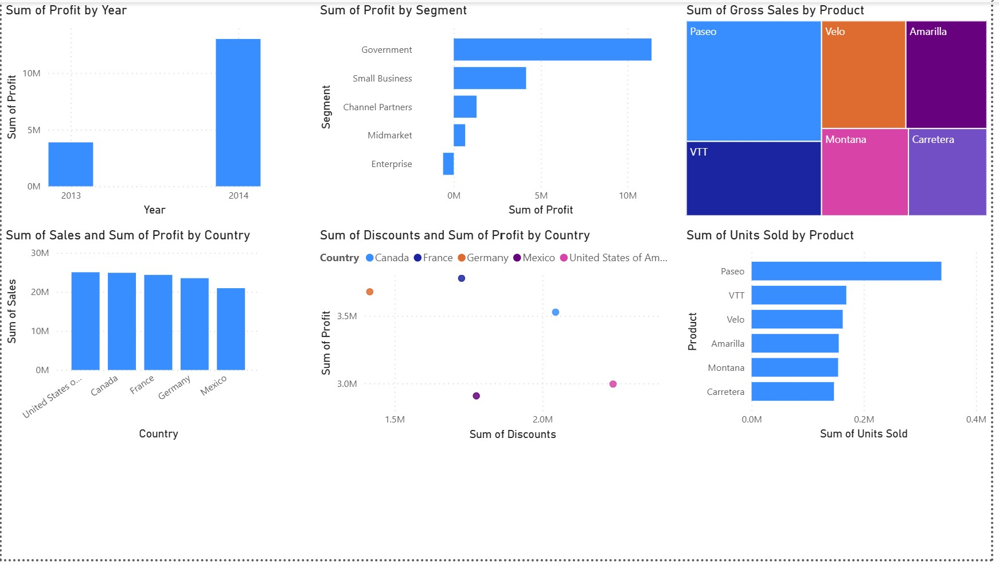

# ERP-CRM-Simulation

This repository contains a simulated ERP (Enterprise Resource Planning) and CRM (Customer Relationship Management) project. The goal of this project is to demonstrate data analysis, reporting, and visualization of financial and customer-related data using Excel and Power BI.

---

## Project Structure

ERP-CRM-Simulation
│ README.md
│
├── Data
│ Financial Sample.xlsx
│
├── PBIX
│ ERP_CRM_Dashboard.pbix
│
└── Docs

- **Data/**  
  Contains the source Excel data used for the simulation.  
  - `Financial Sample.xlsx`: Sample financial dataset with transactions, revenue, expenses, and other business metrics.

- **PBIX/**  
  Contains the Power BI report file.  
  - `ERP_CRM_Dashboard.pbix`: Power BI dashboard for visualizing key financial and CRM metrics.

- **Docs/**  
  Documentation and visuals generated from the project.  
  - `report_snapshot.pdf`: Snapshot of the project report summarizing insights.  
  - `dashboard_screenshot.png`: Screenshot of the Power BI dashboard for quick reference.

---

## 📊 Dashboard Preview

## Overview

The ERP-CRM Simulation project focuses on:

1. **Data Analysis:** Cleaning and analyzing financial and customer data to derive insights.  
2. **Visualization:** Creating interactive dashboards in Power BI to monitor business performance metrics.  
3. **Reporting:** Generating concise reports and snapshots summarizing key findings.

---
## Tools & Technologies

- Microsoft Excel  
- Microsoft Power BI Desktop  
